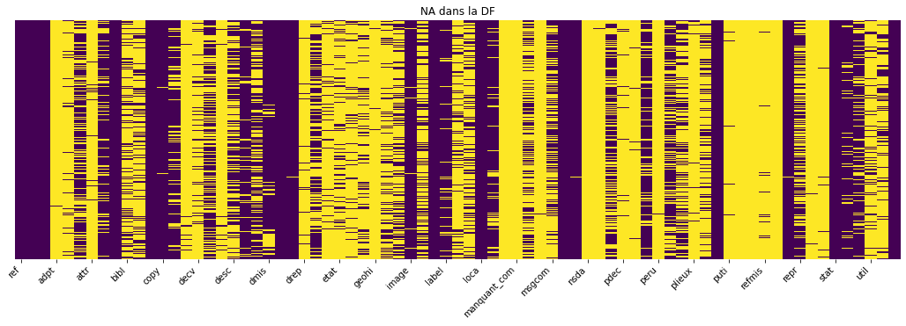
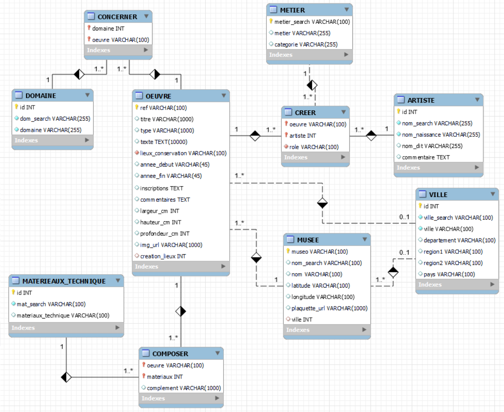
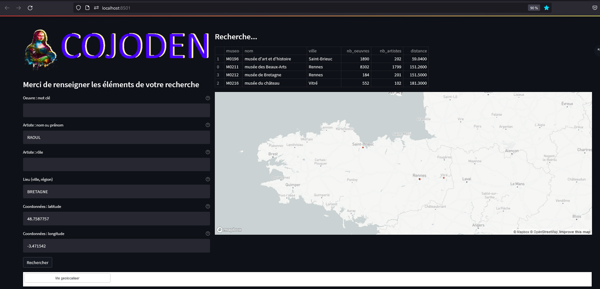

# projet_cojoden_avance

## Contexte

### La mission

La Coopérative des Joyeux Denisoviens, la CoJoDen, une agence de voyages engagée vient de vous embaucher pour créer un prototype informatique.

La CoJoDen a pour objectif d'étoffer son offre et monter en gamme en proposant à ses clients des séjours culturels thématiques. Ces séjours seront définis dynamiquement en fonction des souhaits du client.

Par exemple notre nouvelle cliente italienne Mme Gherardini souhaite organiser un petit périple pour découvrir les oeuvres de `Gaston Chaissac`. Elle ne dispose que d'un weekend et voudrait limiter ses déplacements à deux musées. Si vous regardez dans https://www.pop.culture.gouv.fr/ et vous faites une recherche sur Gaston Chaissac (plusieurs auteurs avec des casses différentes), vous trouverez des oeuvres principalement sur Nantes et Colmar. Vous pourrez proposer un séjour à cette dame en lui indiquant le temps estimé pour aller d'un lieu à l'autre (à vous de trouver un moyen de récupérer le temps de trajet, ce denier point est optionnel dans un premier temps).

A partir d'un extrait la base de donnée Joconde accessible au grand public, vous modéliserez une base de données relationnelle MySQL qui regroupera les informations que vous jugerez nécessaires.

Vous peuplerez la base avec les oeuvres disponibles en nettoyant et en homogénéisant au maximum les infos.

Vous créerez un code python qui servira de démonstrateur sur quelques exemples simples.

### Références

Joconde, catalogue collectif des collections des musées de France

https://www.culture.gouv.fr/Espace-documentation/Bases-de-donnees/Fiches-bases-de-donnees/Joconde-catalogue-collectif-des-collections-des-musees-de-France

data. culture.gouv.fr

La plate-forme de données ouvertes du ministère de la Culture propose un extrait de la base de données Joconde

## Les données

- [Description des données](dataset\DATA_explications.txt)
- [Description des données](dataset\liste_champs_joconde_etiquettes_vdef_20220516.ods)

Suite à une première analyse :

## Description du programme

### Le module `data_preprocessing`

Contient les éléments pour nettoyer les données d'origine. 
- [cojoden_nettoyage.py](data_preprocessing/cojoden_nettoyage.py) : génère un nouveau fichier CSV nettoyé.

- [cojoden_extraction.py](data_preprocessing/cojoden_extraction.py) : Extrait les données par table (cf. MCD) et génère une fichier CSV dédié

- [cojoden_EDA-V1.0.ipynb](data_preprocessing/cojoden_EDA-V1.0.ipynb) : Note book d'exploration des données

### Le module `dao`

Contient tous les éléments liés à la BDD MySql.

- [cojoden_avance_creation_script.sql](dao/cojoden_avance_creation_script.sql) : script SQL de création de la BDD
- [request.sql](dao/request.sql) fichier contenant des requêtes SQL utilisées dans le projet
- [cojoden_avance_mcd.mwb](dao/cojoden_avance_mcd.mwb) : schéma de la BDD

- [local_mysql.env](dao/local_mysql.env) information de connexion à la BDD

- [cojoden_dao.py](dao/cojoden_dao.py) : initialisation de la BDD, gestion de la connexion, exécution des requêtes

- [cojoden_dao_populate_from_csv.py](dao/cojoden_dao_populate_from_csv.py) permet de peupler la BDD après la création, le peuplement est réalisé à partir des fichiers CSV générés lors du `data_processing`

- [cojoden_dao_export_csv.py](dao/cojoden_dao_export_csv.py) export des tables au format CSV pour un dump par exemple.

- [cojoden_dao_search.py](dao/cojoden_dao_search.py) contient toutes les fonctions de recherche de données

### Le module `demonstrator`

- [demonstrator.py](demonstrator/demonstrator.py) contient les fonctions de récupération des paramètres et d'appel aux DAO pour les recherches

- [cojoden_app_streamlit.py](demonstrator/cojoden_app_streamlit.py) application streamlit 

